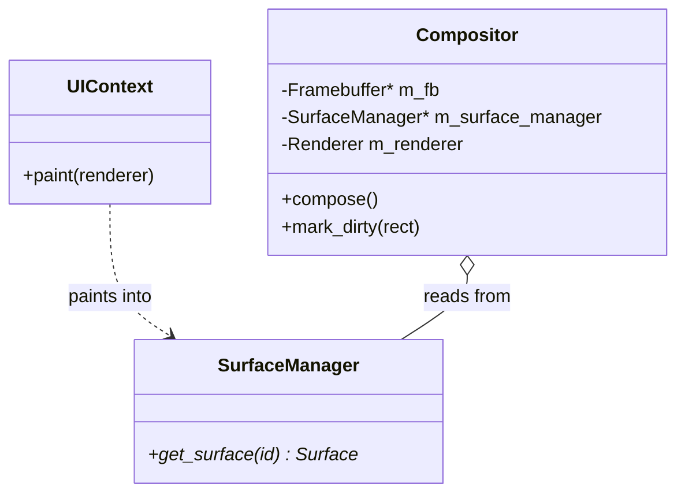

# Phase 10: Compositor Integration Design

## Architectural Overview
The `Compositor` is the final stage of the visual pipeline. It takes the individual surfaces rendered by each `Window` (via their `UIContext`) and blends them onto the final screen framebuffer.

### Visual Pipeline
1. **Application Pass**: Each Window's `UIContext` renders its widget tree into a private `Surface`.
2. **Commit Pass**: Windows notify the `Compositor` that their surface has changed.
3. **Composition Pass**: The `Compositor` blends all window surfaces in Z-order.
4. **Display Pass**: The final framebuffer is sent to the physical monitor.

## Components
1. **SurfaceManager**: Manages the off-screen buffers for each window.
2. **Compositor**:
   - Performs **Alpha Blending** for transparent windows.
   - Implements **Damage Tracking** (Dirty Rectangles) to only redraw parts of the screen that changed.
   - (Planned) Implements **Glassmorphism/Blur** by reading from the background before drawing a window.

## Class Diagram

## Advanced Effects (Architectural Design)
- **Blur Behind**: To implement blur, the Compositor will:
    1. Determine the window area.
    2. Copy the current framebuffer contents of that area to a temporary buffer.
    3. Apply a convolution filter (Gaussian/Box blur).
    4. Draw the blurred buffer back.
    5. Overlay the window's own content with alpha transparency.
- **Hardware Acceleration**: The compositor interfaces are designed to be offloaded to a GPU. Instead of manual pixel loops, the `compose()` pass would issue draw calls to a 2D/3D accelerator (e.g., VirtIO-GPU).

## Performance Considerations
- **Damage Tracking**: By only blending pixels inside "damaged" rectangles, we save significant CPU cycles, especially on high-resolution displays.
- **SIMD**: Pixel blending loops can be optimized using AVX/SSE instructions in a freestanding environment.
- **Memory Bandwidth**: Minimizing copies between window surfaces and the framebuffer is critical.

## Comparison with Legacy
- **Legacy**: Simple direct-to-framebuffer drawing (flicker-heavy) or simple non-alpha-aware blitting.
- **Modern**: Fully buffered, alpha-aware composition with support for sophisticated visual effects.
