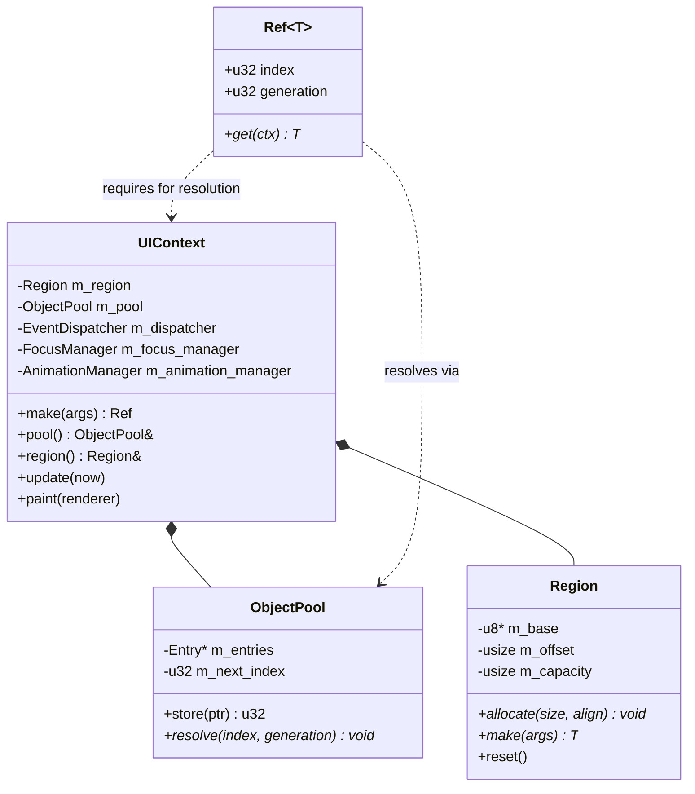

# Phase 1: Core Infrastructure Design

## Architectural Overview
The foundation of the ACOS Modern GUI Framework (AMGF) relies on a custom memory management system designed for high performance and safety in a freestanding environment. It avoids the overhead of standard library smart pointers and provides predictable allocation patterns.

### Components
1. **Region (Arena Allocator)**:
   - Provides O(1) allocation via a bump-pointer.
   - Ideal for UI trees where many small objects are created together and can be destroyed together.
   - Eliminates fragmentation within the arena.

2. **ObjectPool**:
   - Manages the lifecycle and identification of objects within the `Region`.
   - Uses **Generational Handles** to solve the ABA problem and prevent dangling pointer access.
   - Each entry in the pool stores the raw pointer and a `generation` counter.

3. **Ref<T>**:
   - A 64-bit handle (`u32 index`, `u32 generation`).
   - Type-safe wrapper for pool indices.
   - Resolving a `Ref<T>` involves looking up the index in the `ObjectPool` and verifying the generation.

4. **UIContext**:
   - The central coordinator for a UI instance (typically one per Window).
   - Owns the `Region` and `ObjectPool`.
   - Provides the `make<T>(...)` factory method which handles both allocation in the region and registration in the pool.

## Class Diagrams

## Ownership & Lifetime
- **Ownership**: The `UIContext` owns the memory. Widgets and other UI objects do not own each other via pointers; they "own" each other's handles (`Ref<T>`).
- **Lifetime**: Objects are valid as long as the `UIContext` is alive. The `Region` is wiped only when the context is reset or destroyed.

## Performance Implications
- **Allocation**: Extremely fast bump-pointer allocation.
- **Deallocation**: Zero-cost individual deallocation (all-at-once destruction).
- **Access**: One level of indirection through the pool, but highly cache-friendly if objects are allocated in traversal order.
