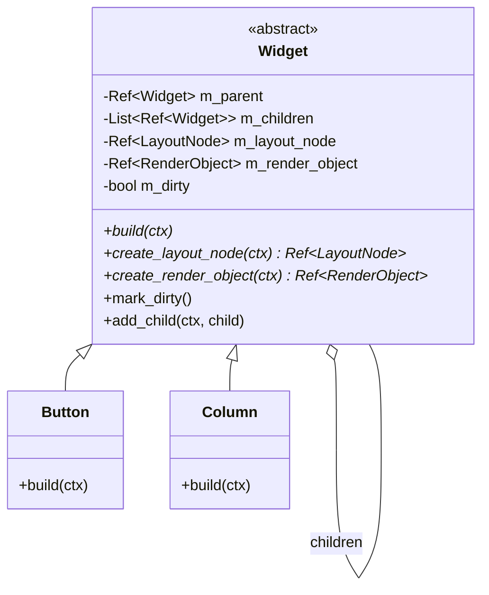

# Phase 2: Widget Tree & Dirty Tracking Design

## Architectural Overview
The Widget tree represents the **declarative blueprint** of the UI. Unlike traditional UI frameworks where widgets are long-lived stateful objects that handle their own drawing, AMGF Widgets are lightweight objects that describe *what* should be on screen.

### Core Principles
1. **Parent-Child Relationship**: Every Widget can have zero or more children. Ownership is managed by the `UIContext` region, but the tree structure is maintained via `Ref<Widget>`.
2. **Immutability (Blueprint Pattern)**: Widgets should be treated as mostly immutable descriptions. When a property changes, the widget is marked dirty.
3. **Dirty Flag Tracking**:
   - `mark_dirty()`: Notifies the system that this widget's properties or children have changed.
   - During the `update` pass, the `UIContext` traverses the tree and calls `build()` on dirty widgets.
   - This allows for **Reactive Updates**: changing a single value only rebuilds the affected branch.

## Class Diagram

## Performance & Scalability
- **Dynamic Growth**: The `List<Ref<Widget>>` uses the region allocator, allowing for an unlimited number of children without the overhead of `std::vector` reallocations.
- **Tree Traversal**: The `UIContext::rebuild_dirty_widgets` pass is an efficient recursive traversal. Since widgets are allocated in a contiguous region, this traversal is cache-friendly.
- **Partial Rebuilds**: Only dirty widgets and their children are re-evaluated, preventing unnecessary layout and rendering work for static parts of the UI.

## Implementation Notes
- Widgets must not store persistent state that isn't derived from their properties (unless using the `State<T>` mechanism in Phase 7).
- `add_child` triggers `mark_dirty()` on the parent, ensuring the layout and render trees are updated to include the new child.
