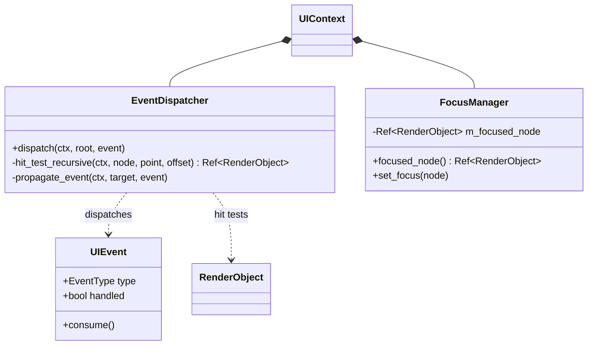

# Phase 3: Event System Design

## Architectural Overview
AMGF uses a three-phase event propagation model (Capture, Target, Bubble) inspired by modern web and UI framework standards (DOM, Flutter). This ensures that parent widgets can intercept events before children, and unhandled events can bubble up to parents.

### Event Phases
1. **Capture Phase**: The event travels from the root of the render tree down to the target object. Parents can intercept and "consume" the event here.
2. **Target Phase**: The event reaches the `RenderObject` that was hit. (In our implementation, this is merged into the start of the Bubble phase or the end of Capture).
3. **Bubble Phase**: The event travels from the target back up to the root. This is where most handling (clicks, typing) occurs.

### Components
1. **UIEvent**: A unified structure representing mouse, keyboard, and focus events. It includes a `handled` flag to stop propagation.
2. **EventDispatcher**:
   - Performs **Recursive Hit Testing** for mouse events to find the deepest `RenderObject` containing the point.
   - Manages the path from root to target for propagation.
3. **FocusManager**:
   - Tracks which `RenderObject` currently has keyboard focus.
   - Routes keyboard events directly to the focused object.

## Class Diagram

## Event Flow for Mouse Down
1. User clicks at `(x, y)`.
2. `UIContext::process_event` calls `EventDispatcher::dispatch`.
3. `hit_test_recursive` starts at `render_root`.
4. Each `RenderObject` checks if the point is within its bounds.
5. The deepest child containing the point is returned as the `target`.
6. `propagate_event` builds a list of ancestors (the "event path").
7. **Capture Phase**: Calls `handle_event(..., Capture)` on each object from Root to Target.
8. **Bubble Phase**: Calls `handle_event(..., Bubble)` on each object from Target to Root.
9. If any object calls `event.consume()`, propagation stops immediately.

## Performance Considerations
- **Hit Testing**: O(Depth of Tree). Cache-friendly as it follows the render tree.
- **Propagation Path**: Uses a small fixed-size stack-allocated array (size 64) for the event path to avoid heap allocations.
- **Consumption**: Efficiently short-circuits propagation as soon as an event is handled.

## Comparison with Legacy
- **Legacy**: Broadcasted events to all widgets, leading to O(N) performance where N is the total number of widgets.
- **Modern**: Targeted routing with O(log N) or O(Depth) performance. Supports complex interactions like parent-intercepted gestures.
